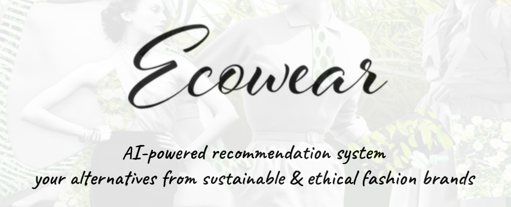
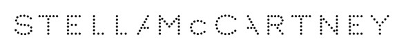
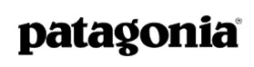
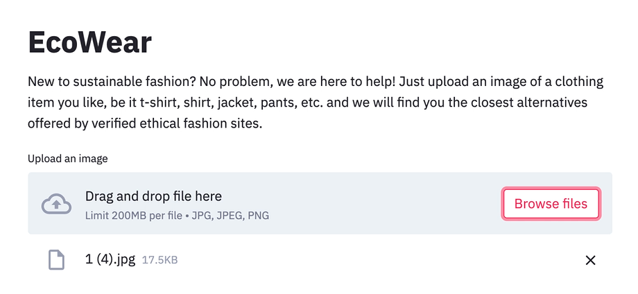
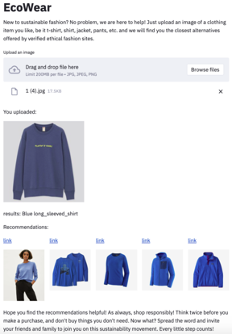
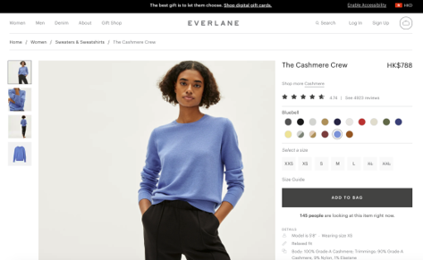
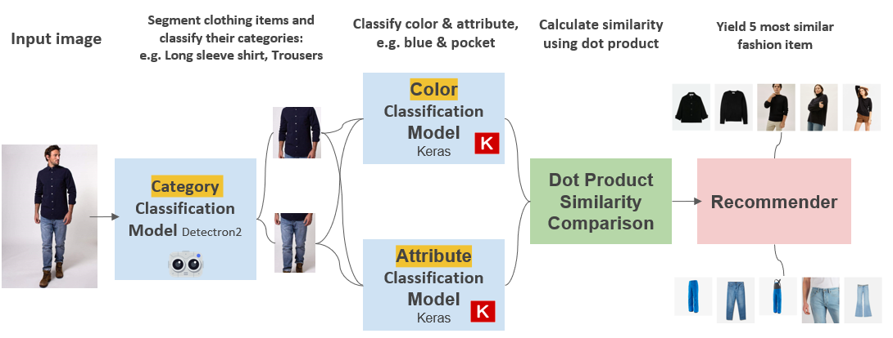
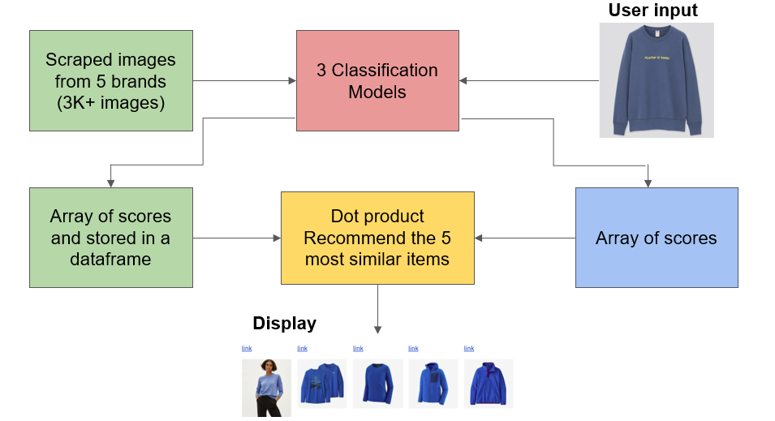

 
## Data source
 For the model training, 80K+ different fashion item images from [DeepFashion](http://mmlab.ie.cuhk.edu.hk/projects/DeepFashion.html) & [DeepFashion2](https://github.com/switchablenorms/DeepFashion2).
 
 For the recommendation catalog, 3K+ images are scraped from 5 ethical brands, which are rated as 'good'/'great' in a sustainability rating site '[Good On You](https://goodonyou.eco/)'. The 5 brands are:
 
  
  
  
  
  

## How does it work??
 **Step 1: Uploading an image with fashion items**  
 
 
 **Step 2: View the 5 closest alternative recommendation**
 
 
 
 **Step 3: Click the link to view product details or make a purchase on the ethical fashion site**
 
 

## Working principle
 - 3 models were trained separately to classify **categories(13)**, **colors(10)**, and **attributes(8)** of the input image and scraped images. 
 - Each image will be turned into 31-feature array
 - Similarity was calculated using dot product
 - Finally our recommender yields 5 most similar fashion items.
 
 System architecture: 
 
 
 Recommendation flow: 
 

## Classification models
**1. Category**
- Using Detectron2 library
- Architecture of Faster R-CNN
- Accuracy up to 68%

**2. Color**
- Using Keras library
- Architecture referencing to a [research paper from the team of Reza Fuad Rachmadi](https://arxiv.org/pdf/1510.07391.pdf)
- Accuracy up to 70%

**3. Attribute**
- Using Keras library
- Transfering learning from VGG16
- Accuracy up to 52%

## Deployment
 The 3 models are deployed in local machine using Streamlit.

## Challenges
- Lack of real time recommended product data from the ethical brands
  - Solution: Use API as data source (if presence), scrape the product frequently
- Subjectivity in color labelling

## Skills Acquired
- 
