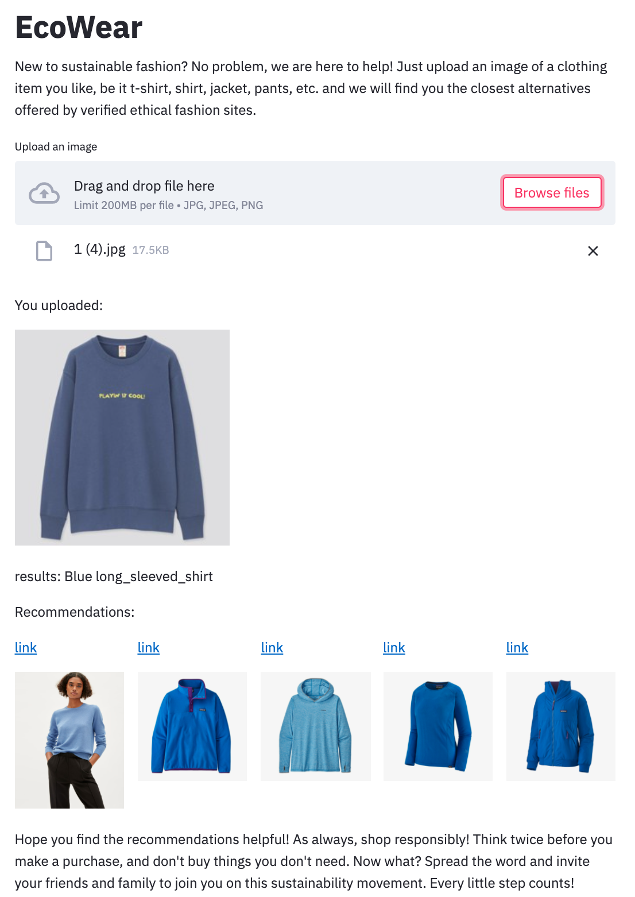

 
### Data source
 For the model training, 80K+ different fashion item images from [DeepFashion](http://mmlab.ie.cuhk.edu.hk/projects/DeepFashion.html) & [DeepFashion2](https://github.com/switchablenorms/DeepFashion2).
 
 For the recommendation catalog, 3K+ images are scraped from 5 ethical brands, which are rated as 'good'/'great' in a sustainability rating site '[Good On You](https://goodonyou.eco/)'. The 5 brands are:
 
  
  
  
  
  

### How does it work??
 Step 1: Uploading an image with fashion items 
 
 
 Step 2: View the 5 closest alternative recommendation  
 
 
 Step 3: Click the link to view product details or make a purchase on the ethical fashion site  
 
